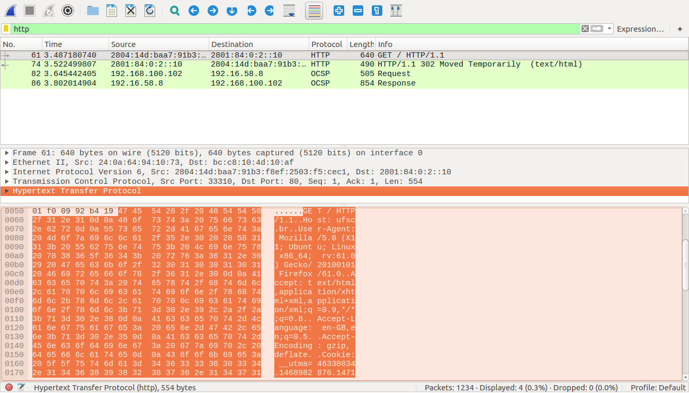

# Exercício 1
###### INE5615 - Redes de Computadores - 05238 (20182)
Artur Silva Muniz Junior - 16101095
___
### 1) ifconfig

#### a - Executando o comando `ifconfig wlp3s0` obtemos o retorno

```sh
> ifconfig wlp3s0
wlp3s0    Link encap:Ethernet  Endereço de HW 24:0a:64:94:10:73  
          inet end.: 192.168.100.102  Bcast:192.168.100.255  Masc:255.255.255.0
          endereço inet6: 2804:14d:baa7:91b3::c/128 Escopo:Global
          endereço inet6: 2804:14d:baa7:91b3:4d30:a121:51a0:100b/64 Escopo:Global
          endereço inet6: fe80::ab60:49:ba00:f5af/64 Escopo:Link
          endereço inet6: 2804:14d:baa7:91b3:bf7f:d30f:478a:af15/64 Escopo:Global
          UP BROADCAST RUNNING MULTICAST  MTU:1500  Métrica:1
          pacotes RX:6728 erros:0 descartados:0 excesso:0 quadro:0
          Pacotes TX:6548 erros:0 descartados:0 excesso:0 portadora:0
          colisões:0 txqueuelen:1000
          RX bytes:7196123 (7.1 MB) TX bytes:882673 (882.6 KB)
```

Nota: O parametro `wlp3s0` indica o adaptador de rede sem fio configurado no computador onde executou-se o trabalho.

#### b - identifique o MAC address e o IP da sua máquina na saída do comando ifconfig que você executou no item a.
MAC address: `24:0a:64:94:10:73`
IP: `192.168.100.102`

#### c - identifique o IP do gateway padrão.

```sh
> route -n
Tabela de Roteamento IP do Kernel
Destino         Roteador        MáscaraGen.    Opções Métrica Ref   Uso Iface
0.0.0.0         192.168.100.1   0.0.0.0         UG    600    0        0 wlp3s0
169.254.0.0     0.0.0.0         255.255.0.0     U     1000   0        0 docker0
172.17.0.0      0.0.0.0         255.255.0.0     U     0      0        0 docker0
192.168.100.0   0.0.0.0         255.255.255.0   U     600    0        0 wlp3s0
```

IP do gateway padrão: `192.168.100.1`

___
### 2) Netstat
```sh
> netstat -atn
Conexões Internet Ativas (servidores e estabelecidas)
Proto Recv-Q Send-Q Endereço Local          Endereço Remoto         Estado      
tcp        0      0 0.0.0.0:139             0.0.0.0:*               OUÇA      
tcp        0      0 127.0.0.1:6379          0.0.0.0:*               OUÇA      
tcp        0      0 127.0.0.1:30800         0.0.0.0:*               OUÇA      
tcp        0      0 127.0.0.1:30900         0.0.0.0:*               OUÇA      
tcp        0      0 127.0.1.1:53            0.0.0.0:*               OUÇA      
tcp        0      0 127.0.0.1:631           0.0.0.0:*               OUÇA      
tcp        0      0 127.0.0.1:9050          0.0.0.0:*               OUÇA      
tcp        0      0 0.0.0.0:445             0.0.0.0:*               OUÇA      
tcp        0      0 192.168.100.102:40998   52.26.82.186:443        TIME_WAIT  
tcp        0      0 192.168.100.102:54384   52.36.144.100:443       ESTABELECIDA
tcp        0      0 192.168.100.102:38352   34.212.110.138:443      ESTABELECIDA
tcp        0      0 192.168.100.102:50568   192.16.58.8:80          ESTABELECIDA
tcp        0      0 192.168.100.102:52470   94.130.186.5:443        ESTABELECIDA
tcp        0      0 192.168.100.102:46124   34.218.161.111:443      TIME_WAIT  
tcp        0      0 192.168.100.102:55082   216.58.202.196:443      ESTABELECIDA
tcp        0      0 192.168.100.102:54382   52.36.144.100:443       ESTABELECIDA
tcp6       0      0 :::139                  :::*                    OUÇA      
tcp6       0      0 :::80                   :::*                    OUÇA      
tcp6       0      0 ::1:631                 :::*                    OUÇA      
tcp6       0      0 :::443                  :::*                    OUÇA      
tcp6       0      0 :::445                  :::*                    OUÇA      
tcp6       0      0 2804:14d:baa7:91b:59520 2800:3f0:4001:817:::443 ESTABELECIDA
tcp6       0      0 2804:14d:baa7:91b:33076 2801:84:0:2::10:80      ESTABELECIDA
tcp6       0      0 2804:14d:baa7:91b:54232 2800:3f0:4001:817::2:80 TIME_WAIT  
tcp6       0      0 2804:14d:baa7:91b:35704 2800:3f0:4001:815:::443 ESTABELECIDA
tcp6       0      0 2804:14d:baa7:91b:59286 2800:3f0:4001:817:::443 ESTABELECIDA
tcp6       0      0 2804:14d:baa7:91b:59636 2801:84:0:2::10:443     TIME_WAIT  
tcp6       0      0 2804:14d:baa7:91b:60764 2800:3f0:4001:800:::443 ESTABELECIDA
```

IP e porta usada na conexão com o site www.ufsc.br:

| Maquina | Versão IP | IP | Porta |
| :-------------: | :-------------: | :-------------: | :-------------: |
| local | ipv6 | 2804:14d:baa7:91b | 59636 |
| site | ipv6 | 2801:84:0:2::10 | 443 (https) |

___
### 3) ARP
#### Digite o seguinte comando no prompt ou terminal: arp -a (No Linux, em versões mais novas: ip n).

```sh
> arp -a
? (192.168.100.1) em 40:9b:cd:29:f2:5c [ether] em wlp3s0
```
#### Explique a saída obtida na execução do comando.
O comando `arp -a` sem nenhum parametro adicional mostra todas as entradas do cache ARP do kernel. É possivel ver a entrada para uma maquina em especifica passando o endereço da maquina como valor para o parametro `-a` (ex. `arp -a 192.168.100.1`)
Observe que no retorno obtido encontra-se no cache apenas a entrada para o gateway padrão, e que o MAC address do mesmo é `40:9b:cd:29:f2:5c`.

### 4) Qual endereço IP está presente na tabela ARP:
#### da sua máquina ou do gateway padrão? Compare as imagens das questões 1.c e 3.

1.c
```sh
> route -n
Tabela de Roteamento IP do Kernel
Destino         Roteador        MáscaraGen.    Opções Métrica Ref   Uso Iface
0.0.0.0         192.168.100.1   0.0.0.0         UG    600    0        0 wlp3s0
```

3.

```sh
> arp -a
? (192.168.100.1) em 40:9b:cd:29:f2:5c [ether] em wlp3s0
```

Na tabela ARP encontramos o IP do gateway padrão. O IP da maquina pode ser encontrado na resultado do comando `ifconfig` (como mostrado na atividade 1.b)

### 9. Usando esta linha de tráfego (do GET), explique o encapsulamento das camadas.


Para entender o encapsulamento é necessario prestar atenção aos dois paneis inferiores da imagem a cima.
Nota-se que ao clicar em uma das camadas no painel do meio, no painel de baixo é dado destaque aos bytes que são relativos a mesma.

Na interface do wireshark nota-se que quando clicamos na cadama de Aplicação, os bytes destacados são os ultimos e que, conforme vamos descendo as camadas, os bytes destacados são os que estão justapostos a frente dos da camada anterior.
Isso bem representa como funciona o encapsulamento, onde os dados das camadas vão sendo concatenados com os dados das camadas anteriores.
<br> No exemplo da imagem, os dados da camada de Aplicação (HTTP) foram concatenados aos da camada de transporte (TCP) para formar o segmento.
<br> O segmento foi então concatenado aos dados da camada de rede, para formar um pacote
<br> O pacote foi concatenado aos dados da camada de enlace, formando um quadro.
<br> Dessa forma, cada camada contem seus dados e os dados da camada superior.

#### 10. Envie o arquivo de captura de tráfego.
Em anexo no arquivo `captura1ArturMuniz.pcapng`
